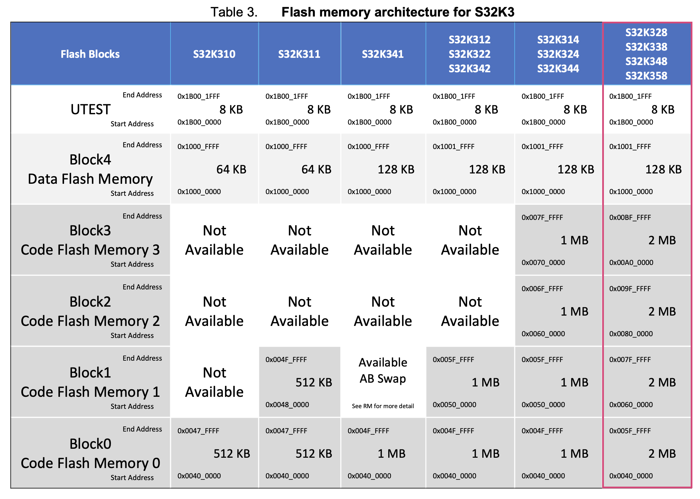

# CAOS project: QEMU emulation of NXP S32K3X8EVB
## QEMU Overview
QEMU is an emulator that allows programs written for one microprocessor to be emulated and run on a host running a different microprocessor.

Central to the working of QEMU is the QEMU Object Model or QOM. Every device is represented in the QOM in an object-oriented way. In particular, when creating a new type (e.g., a new machine) we need to register it with QOM.

Because C doesn't naturally represent object-oriented systems there's a lot of moving parts in the QEMU C implementation to make this work. Fortunately, many macros are provided to make it more straightforward. Furthermore, classes are represented as structs.

QOM uses two parallel class hierarchies that split the needed features:
- Structs deriving from Object are DeviceState and contain per-instance information
- Structs deriving from ObjectClass are DeviceClass and have per-class information.

To tell QOM how to create objects we need to create a static instance of TypeInfo for the type and then register it. The init function will create instances of the objects.

Peripherals are attached to the specific memory bus and generate the appropriate interrupt to notify HW events, using the correct IRQ lines. Peripheral registers are accessible through the memory bus.

## NXP S32K3X8EVB board
The NXP S32K3X8EVB board is based on the 32-bit Arm®Cortex®-M7 S32K358 MCU ([NXP website](https://www.nxp.com/design/design-center/development-boards-and-designs/S32K3X8EVB-Q289)). The Arm Cortex-M7 processor is the highest-performing processor in the Cortex-M family that enables the design of sophisticated MCUs and SoCs. The executing frequency can be at most 240 MHz, depending on the actual clocking mode. Anyway, in QEMU it does not match real time, since its advancement speed depends on how fast host CPU runs guest instructions. For simplicity, we use 24 MHz as clock frequency both for the board and the peripherals, since we found this value in an official FreeRTOS demo of the board.

### Memory regions
The [S32K3 Memories Guide Application note](docs/AN13388.pdf) describes the memory features included in the board. The following images are taken from that document.




In particular, it supports:
- 8 MB of code flash, divided into four blocks
- 128 KB of data flash
- 768 KB of SRAM, divided into three blocks
- 256 KB of data TCM (low-latency memory that can be used by the processor), divided into two blocks
- 128 KB of instruction TCM, divided into two blocks

Instruction TCM can be used to hold critical routines, such as interrupt handling routines or real-time tasks where the indeterminacy of a cache would be highly undesirable. The interrupt vector table is stored in ITCM0, located at 0x0 (while the NOR flash memory is at 0x400000). When the processor is powered on, the reset is the first operation executed. The kernel, instead, is loaded in the NOR flash memory.

The optional MPU has configurable attributes for memory protection. It includes up to 16 memory regions and sub region disable (SRD), enabling efficient use of memory regions. It also has the ability to enable a background region that implements the default memory map attributes.

### Device tree
ARM architecture uses the device tree to specify connected device on memory bus. Beyond the memories already described, the board has 16 LPUART and three periodic interrupt timers that will be described in the next sections. The memory mapping is fully described by the [S32K3xx_memory_map.xlsx](docs/S32K3xx_memory_map.xlsx) file.

```
    0000000000000000-000000000000ffff (prio 0, ram): s32k358.itcm0
    0000000000400000-00000000005fffff (prio 0, ram): s32k358.cflash0
    0000000000600000-00000000007fffff (prio 0, ram): s32k358.cflash1
    0000000000800000-00000000009fffff (prio 0, ram): s32k358.cflash2
    0000000000a00000-0000000000bfffff (prio 0, ram): s32k358.cflash3
    0000000010000000-000000001001ffff (prio 0, ram): s32k358.dflash0
    000000001b000000-000000001b001fff (prio 0, ram): s32k358.utest
    0000000020000000-000000002001ffff (prio 0, ram): s32k358.dtcm0
    0000000020400000-000000002043ffff (prio 0, ram): s32k358.sram0
    0000000020440000-000000002047ffff (prio 0, ram): s32k358.sram1
    0000000020480000-00000000204bffff (prio 0, ram): s32k358.sram2
    00000000400b0000-00000000400b013f (prio 0, i/o): s32k358-timer0
    00000000400b4000-00000000400b413f (prio 0, i/o): s32k358-timer1
    00000000402fc000-00000000402fc13f (prio 0, i/o): s32k358-timer2
    0000000040328000-00000000403287ff (prio 0, i/o): uart0
    000000004032c000-000000004032c7ff (prio 0, i/o): uart1
    0000000040330000-00000000403307ff (prio 0, i/o): uart2
    0000000040334000-00000000403347ff (prio 0, i/o): uart3
    0000000040338000-00000000403387ff (prio 0, i/o): uart4
    000000004033c000-000000004033c7ff (prio 0, i/o): uart5
    0000000040340000-00000000403407ff (prio 0, i/o): uart6
    0000000040344000-00000000403447ff (prio 0, i/o): uart7
    000000004048c000-000000004048c7ff (prio 0, i/o): uart8
    0000000040490000-00000000404907ff (prio 0, i/o): uart9
    0000000040494000-00000000404947ff (prio 0, i/o): uart10
    0000000040498000-00000000404987ff (prio 0, i/o): uart11
    000000004049c000-000000004049c7ff (prio 0, i/o): uart12
    00000000404a0000-00000000404a07ff (prio 0, i/o): uart13
    00000000404a4000-00000000404a47ff (prio 0, i/o): uart14
    00000000404a8000-00000000404a87ff (prio 0, i/o): uart15
```

### Interrups
The NVIC is closely integrated with the core to achieve low-latency interrupt processing. It presents external interrupts, configurable from 1 to 240. The configured IRQs (fully described in [S32K3xx_interrupt_map.xlsx](docs/S32K3xx_interrupt_map.xlsx)) are the followings:
- from 141 to 156 for the LPUARTs
- 96, 97 and 98 for the PIT timers

## Low Power Universal Asynchronous Receiver/Transmitter (LPUART)
The board contains sixteen instances of LPUART, providing asynchronous, serial communication capabilities with external devices. LPUART0, LPUART1 and LPUART8 are clocked by AIPS_PLAT_CLK (up to 120MHz), while the others by AIPS_SLOW_CLK (up to 60 MHz). We implemented both its two main functionalities: transmit data from the frontend (e.g. FreeRTOS application) to the backend (the board) and vice versa with FIFO functionality and interrupt support. The whole description can be found in the reference manual of the board (from page 4588).

The implemented registers (and thus configurable parameters) are:
- version ID (read-only).
- parameter (read-only): indicates the parameter configuration (the receive and transmit FIFO size).
- global: performs global functions, triggering the reset of the registers.
- baud: configures the baud rate.
- status: provides the module status (e.g. whether the transmit FIFO level is greater than, equal to, or less than the watermark, the transmission is completed or the receive FIFO level is less than, equal to, or greater than the watermark).
- control: controls various optional features of the LPUART system (e.g., whether the transmitter/receiver and their interrupts are enabled and the parity bit is included).
- data: byte to be read from the receive FIFO or to be written to the transmit FIFO.
- fifo: provides you the ability to turn on and off the FIFO functionality.
- watermark: provides the ability to set a programmable threshold for notification, or sets the programmable thresholds to indicate that transmit data can be written or receive data can be read.

Depending on the instances, the FIFO can be of 16 B or 4 B; if the FIFO is disabled it is as if there was a FIFO of one byte. Our LPUART implementation does not support character sizes different from 8 bits.

### Transmit
```
USER APPLICATION WRITES 1 BYTE
              │
              │
              ▼                 copy into                                                      transmit
  ┌───────────────────────┐                      ┌────────┐                ┌────────────────┐
  │  DATA REGISTER [0:7]  ├───────────────────►  │  FIFO  ├───────────────►│ SHIFT REGISTER ├─────────────►
  └───────────────────────┘                      └────────┘                └────────────────┘
                              if there is
                             space available   FIFO disabled =
                                               FIFO 1 BYTE
```
The user application writes data into the data register. If the transmitter is enabled and there is enough space in the transmit FIFO the byte is copied into it, otherwise the overflow flag is set. Then, the transmitter is set to active and the FIFO is no more empty. If there is no backend connected, the transmission cannot take place. Otherwise, data will be sent from the front end to the back end. If something goes wrong and there is still something in the FIFO after the transmission, we try to retransmit. Otherwise, the transmission is set as completed and the FIFO as empty. At every step we check whether the IRQ or the watermark register must be updated.

### Receive
```
USER APPLICATION READS 1 BYTE
              ▲
              │
              │                 copy into                     copy into                         receive
  ┌───────────┴───────────┐                      ┌────────┐                ┌────────────────┐
  │  DATA REGISTER [0:7]  │◄─────────────────────┤  FIFO  │◄───────────────┤ SHIFT REGISTER │◄────────────
  └───────────────────────┘                      └────────┘                └────────────────┘

                                               FIFO disabled =
                                               FIFO 1 BYTE
```
In this case, when the user tries to read the data register, we check whether the receive FIFO contains some data, otherwise we set the underflow flag. Then, the first byte is copied from the receive FIFO to the data register. An interrupt can be triggered when something is written into the receive FIFO, in order to inform the user application that data can be read.

## Periodic Interrupt Timers (PIT)
This board has three instances of the PIT, each composed of 4 PIT timers/channels. Each channel is 32 bits in length. They are clocked by AIPS_SLOW_CLK (up to 60 MHz). We do not model the RTI, the Lifetime Timer and Timer chaining. When the timer is enabled, it counts down from its initial value to zero. When it expires it sets the Timer Interrupt Flag. If the timer interrupt is enabled and the Timer Interrupt Flag is set, it generates an interrupt. The interrupt remains set until you explicitly clear the flag. It then reloads the timer start value and starts
the timer counting down again. The interrupt line is shared by all the channels of the same PIT. To change the counter period of a running timer, we specify a new start value: the next time the timer expires, it loads the new start value. The whole description can be found in the reference manual of the board (from page 2808).

The implemented registers (and thus configurable parameters) are:
- PIT Module Control: enables the PIT timer and specifies the behavior of the timers when PIT enters Debug mode.
- Timer Load Value: specifies the length of the timeout period in clock cycles for the relative channel.
- Current Timer Value (read-only): indicates the current timer value.
- Timer Control: controls timer behavior (e.g., timer enable and interrupt enable).
- Timer Flag: indicates the PIT timer has expired.

Note that while the PIT Module Control is unique for the whole PIT, there is an instance for each channel of the other registers.

## FreeRTOS demo application
FreeRTOS is a class of RTOS that is designed to be small enough to run on a microcontroller. We developed a demo application to show the functionality of the implemented board. Hence, the description of that application follows.

In particular, we will demonstrate the usage of three timers (PIT0 channels 0 and 1 and PIT1 channel 0) and LPUART0, both to write and to receive data.

### Main file
In the main file four tasks are created:
- TaskA: when timer 0 channel 0 expires, the task prints the current value of the other two timers.
- TaskB: when timer 0 channel 1 expires, the task changes the period of timer 1 channel 0 (halves or doubles the value).
- TaskC: when timer 1 channel 0 expires, the task prints the number of times it expired.
- TaskD: when the user types a sentence followed by enter, the task prints what the user just wrote.

The tasks are unblocked by semaphores, that are given by the interrupt service routines handling the different interrupts.

### LPUART
The LPUART registers are represented by a struct:
```C
typedef struct
{
	__O uint32_t VERID;
	__O uint32_t PARAM;
    __IO uint32_t GLOBAL;
    char UNIMPLEMENTED1[0x4];
    __IO uint32_t BAUD;
    __IO uint32_t STAT;
    __IO uint32_t CTRL;
    __IO uint32_t DATA;
    char UNIMPLEMENTED2[0x28 - 0x20];
    __IO uint32_t FIFO;
    __IO uint32_t WATER;
} S32K358_UART_Typedef;
```
And it is memory mapped at the corresponding address:
```C
#define UART_0_BASE_ADDRESS (0x40328000UL)
#define S32K358_UART0       ((S32K358_UART_Typedef  *) UART_0_BASE_ADDRESS  )
```
The implemented functions are:
- `UART_init`: initializes the peripheral, enabling the receive and transmit FIFO, setting as watermark the FIFO length-1, and enabling transmitter, receiver and receiver interrupt.
- `vUart0Handler`: the handler for the interrupt generated when the user writes something. It keeps collecting characters in a buffer until the buffer is full / the user pressed enter. At that point temporary disables the IRQ and wakes up TaskD.
- `UART_getRxBuffer`: reads from the buffer and enables again the IRQ.
- `UART_printf`: prints the string passed as parameter.

### Timers
A timer single channel is represented by the struct:
```C
typedef struct
{
	__IO uint32_t RELOAD;
	__O  uint32_t  VALUE;
	__IO uint32_t  CTRL;
	union {
		__I    uint32_t  INTSTATUS;
		__O    uint32_t  INTCLEAR;
	};
} S32K358_CHANNEL_TypeDef;
```
The whole PIT is represented by:
```C
typedef struct
{
	__IO uint32_t PIT_CTRL;
	char UNIMPLEMENTED[0x100 - 0x4];
	S32K358_CHANNEL_TypeDef channels[4];
} S32K358_TIMER_TypeDef;
```
The timers' memory mapping is performed by:
```C
#define TIMER_0_BASE_ADDRESS (0x400B0000UL)
#define S32K358_TIMER0       ((S32K358_TIMER_TypeDef  *) TIMER_0_BASE_ADDRESS  )
#define TIMER_1_BASE_ADDRESS (0x400B4000UL)
#define S32K358_TIMER1       ((S32K358_TIMER_TypeDef  *) TIMER_1_BASE_ADDRESS  )
#define TIMER_2_BASE_ADDRESS (0x402FC000UL)
#define S32K358_TIMER2       ((S32K358_TIMER_TypeDef  *) TIMER_2_BASE_ADDRESS  )
```
The implemented functions are:
- `vInitialiseTimers`: initializes the timers, enabling the PIT, the channels and the IRQs.
- `vInitialiseChannel`: initializes each channel of the PIT, enabling it and the relative interrupt and setting the frequency.
- `tGetTimer`: returns a timer object given the id.
- `cGetChannel`: returns a channel object given the timer and the channel id.
- `vTimer0Handler`: handler of the interrupts generated by PIT0. It wakes up TaskA or TaskB (depending on which channel generated the interrupt).
- `vTimer1Handler`: handler of the interrupts generated by PIT1. It wakes up TaskC.
- `ulTimerOK`: checks whether the timer and the channel are enabled.
- `xSetReload`: changes the value of the reload register (used by TaskB) after performing the appropriate checks.
- `ulGetReload`: gets the value of the reload register after performing the appropriate checks.
- `ulGetCount`: gets the value of the value register after performing the appropriate checks.

### Output


